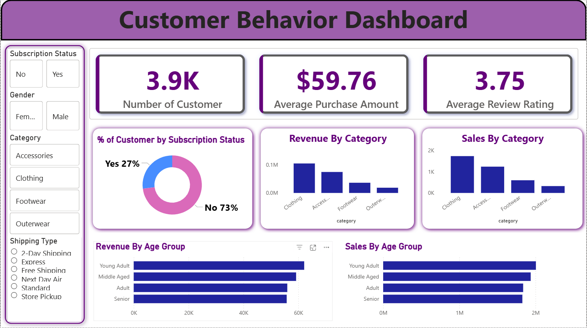

# Customer Behavior Analysis

A comprehensive data analysis project that explores customer shopping behavior patterns using Python and SQL. This project analyzes customer demographics, purchasing patterns, product preferences, and subscription behaviors to derive actionable business insights.

## 📊 Interactive Report View

<p align="center">
  
  <br>
  <em>Interactive Dashboard View</em>
</p>

## 📊 Project Overview

This project performs exploratory data analysis (EDA) on customer shopping behavior data to understand:
- Revenue generation by gender
- Impact of discounts on purchasing behavior
- Product review ratings and popularity
- Shipping preferences and their correlation with spending
- Subscription status impact on customer spending
- Discount usage patterns across products

## 🗂️ Project Structure

```
Customer_Behavior_Analysis/
│
├── customer_shopping_behavior.csv          # Dataset containing customer transaction data
├── customer_shopping_behavior_analysis.ipynb  # Jupyter notebook with Python analysis
├── Business_Queries.sql                    # SQL queries for business insights
├── README.md                               # Project documentation
└── LICENSE                                 # MIT License
```

## 📁 Dataset

The dataset (`customer_shopping_behavior.csv`) contains customer transaction records with the following attributes:
- Customer ID and demographics (gender, age, location)
- Purchase details (item purchased, purchase amount)
- Product information (category, size, color, season)
- Discount and subscription status
- Shipping type
- Review ratings
- Payment methods
- Previous purchases

## 🔍 Analysis Components

### Python Analysis (Jupyter Notebook)
The notebook includes:
- Data loading and preprocessing
- Exploratory Data Analysis (EDA)
- Statistical analysis
- Data visualization
- Pattern identification

### SQL Business Queries
Key business questions answered:
1. **Revenue Analysis**: Total revenue by gender
2. **Discount Impact**: Customers using discounts with above-average spending
3. **Product Ratings**: Top 5 products by average review rating
4. **Shipping Preferences**: Purchase amount comparison between Standard and Express shipping
5. **Subscription Analysis**: Spending patterns of subscribers vs non-subscribers
6. **Discount Patterns**: Products with highest percentage of discounted purchases

## 🛠️ Technologies Used

- **Python 3.x**
  - pandas - Data manipulation and analysis
  - numpy - Numerical computing
  - matplotlib - Data visualization
  - seaborn - Statistical data visualization
- **SQL (PostgreSQL)** - Database queries and analysis
- **Jupyter Notebook** - Interactive development environment

## 📋 Prerequisites

Before running this project, ensure you have the following installed:

- Python 3.7 or higher
- Jupyter Notebook or JupyterLab
- PostgreSQL (for SQL queries)

## 🚀 Installation & Setup

### 1. Clone the Repository

```bash
git clone https://github.com/meetpatel3690/Customer_Behavior_Analysis.git
cd Customer_Behavior_Analysis
```

### 2. Create a Virtual Environment (Optional but Recommended)

```bash
# On Windows
python -m venv venv
venv\Scripts\activate

# On macOS/Linux
python3 -m venv venv
source venv/bin/activate
```

### 3. Install Required Python Packages

```bash
pip install pandas numpy matplotlib seaborn jupyter
```

Or if a `requirements.txt` file is available:

```bash
pip install -r requirements.txt
```

### 4. Launch Jupyter Notebook

```bash
jupyter notebook
```

This will open Jupyter in your browser. Navigate to `customer_shopping_behavior_analysis.ipynb` to view the analysis.

### 5. Running SQL Queries

To run the SQL queries in `Business_Queries.sql`:

1. Set up a PostgreSQL database
2. Import the CSV data into a table named `customer`
3. Execute the queries using a PostgreSQL client (pgAdmin, DBeaver, or psql command line)

```sql
-- Example: Import CSV to PostgreSQL
CREATE TABLE customer (
    customer_id VARCHAR(50),
    gender VARCHAR(20),
    item_purchased VARCHAR(100),
    purchase_amount DECIMAL(10,2),
    discount_applied VARCHAR(10),
    review_rating DECIMAL(3,2),
    shipping_type VARCHAR(50),
    subscription_status VARCHAR(50)
    -- Add other columns as needed
);

COPY customer FROM '/path/to/customer_shopping_behavior.csv' CSV HEADER;
```

## 📈 Key Insights

The analysis reveals important insights about:
- Customer spending patterns across different demographics
- Effectiveness of discount strategies
- Product performance and customer satisfaction
- Shipping preferences and their business impact
- Subscription model effectiveness


## 🤝 Contributing

Contributions are welcome! Please feel free to submit a Pull Request. For major changes:

1. Fork the repository
2. Create your feature branch (`git checkout -b feature/AmazingFeature`)
3. Commit your changes (`git commit -m 'Add some AmazingFeature'`)
4. Push to the branch (`git push origin feature/AmazingFeature`)
5. Open a Pull Request

## 📄 License

This project is licensed under the MIT License - see the [LICENSE](LICENSE) file for details.

## 👤 Author

**Meet Patel**
- GitHub: [@meetpatel3690](https://github.com/meetpatel3690)

## 🙏 Acknowledgments

- Dataset source and data providers
- Open-source community for the amazing tools and libraries
- Contributors and collaborators


---

⭐ If you found this project helpful, please consider giving it a star!
